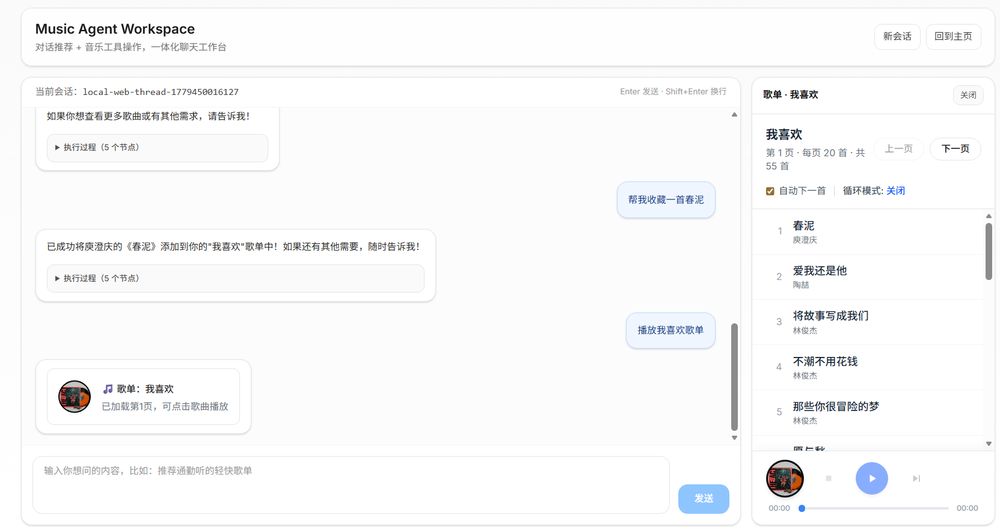
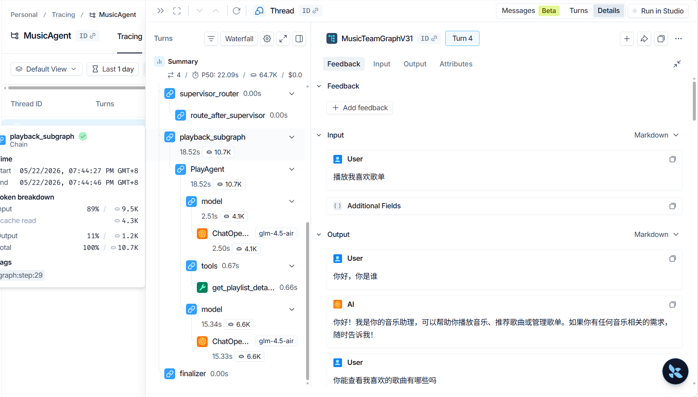

# MusicChatAgent

一个面向“体验与测试”的本地可运行项目：
- 后端：FastAPI + LangChain Agent（音乐检索/推荐相关能力）
- 前端：Next.js 聊天界面（支持在线聊天与本地聊天入口）

本 README 主要面向**使用者/测试同学**，帮助你快速完成「前后端都本地启动」并开始体验。

---

## 1. 你将获得什么

启动后你可以：
- 在浏览器中打开聊天界面，体验音乐助手能力
- 通过前端页面发起请求，由本地后端处理
- 进行基础联调验证（前端请求 → 后端响应）

---

## 2. 环境要求

请先确保本机具备：

- **Python**：推荐 **3.12.6**（当前项目已按该版本验证）
- **Node.js**：建议 18+
- **包管理器**：`npm`（项目中也包含 `pnpm-lock.yaml`，若你使用 pnpm 也可）
- **操作系统**：Windows / macOS / Linux 均可

---

## 3. 项目结构（测试视角）

- `main.py`：后端入口（FastAPI）
- `requirements.txt`：后端依赖
- `app/`：后端业务与接口代码
- `music-agent-chat-ui/`：前端 Next.js 工程

---

## 4. 第一步：启动后端（本地）

在项目根目录（`MusicChatAgent`）打开终端。

> 你当前环境是 Python 3.12.6，可**直接安装依赖并启动**，不强制要求虚拟环境。

### 方案 A（推荐给你当前场景）：不使用虚拟环境

安装依赖：

```bash
pip install -r requirements.txt
```

启动后端：

```bash
python main.py
```

### 方案 B（可选）：使用虚拟环境

创建虚拟环境：

```bash
python -m venv .venv
```

Windows（PowerShell）激活：

```bash
.\.venv\Scripts\Activate.ps1
```

安装依赖并启动：

```bash
pip install -r requirements.txt
python main.py
```

默认监听：
- `http://localhost:8000`
- 接口前缀：`/api/v1`

例如健康探活可先尝试访问：
- `http://localhost:8000/docs`（若接口文档可用）

---

## 5. 第二步：启动前端（本地）

新开一个终端，进入前端目录：

```bash
cd music-agent-chat-ui
```

安装依赖：

```bash
npm install
```

启动开发服务：

```bash
npm run dev
```

默认地址：
- `http://localhost:3000`

---

## 6. 前端连接本地后端

前端工程支持通过环境变量直连本地后端。

在 `music-agent-chat-ui/` 下创建 `.env`（可参考 `.env.example`），至少确认以下配置：

```bash
NEXT_PUBLIC_API_URL=http://localhost:8000
NEXT_PUBLIC_ASSISTANT_ID=agent
NEXT_PUBLIC_AUTH_SCHEME=
```

> 说明：
> - `NEXT_PUBLIC_API_URL`：本地后端地址
> - `NEXT_PUBLIC_ASSISTANT_ID`：当前助手/图 ID（通常可先用 `agent`）
> - 修改 `.env` 后需重启前端服务

---

## 7. 推荐测试流程（5 分钟）

1. 确认后端终端无报错并持续运行
2. 打开 `http://localhost:3000`
3. 进入聊天页面（例如 `/chat` 或项目首页入口）
4. 发送一条简单请求（如“推荐几首周杰伦的歌”）
5. 观察是否返回有效响应

---

## 8. 常见问题排查

### 8.1 前端请求失败 / 无响应

优先检查：
- 后端是否已启动（`python main.py`）
- `NEXT_PUBLIC_API_URL` 是否正确指向 `http://localhost:8000`
- 前端是否重启过（修改 `.env` 后必须重启）

### 8.2 跨域问题（CORS）

当前后端允许来源：`http://localhost:3000`。如果你前端不是这个端口，请同步调整后端 CORS 配置。

### 8.3 Python 依赖安装报错

建议先升级 pip 再重装：

```bash
python -m pip install --upgrade pip
pip install -r requirements.txt
```

### 8.4 端口冲突

- 前端默认 3000
- 后端默认 8000

如端口被占用，请关闭占用进程，或修改启动端口并同步更新前端环境变量。

---

## 9. 给测试同学的建议

- 建议保留两个终端窗口：
  - 终端 A：后端日志
  - 终端 B：前端日志
- 复现问题时记录：
  - 输入内容
  - 页面路径
  - 浏览器控制台报错
  - 后端终端报错

这样开发同学可以更快定位问题。

---

## 10. 运行截图

### 聊天返回示例



### LangSmith 追踪过程



> 说明：其余截图暂未加入 README，可后续按需补充。

---

## 11. 相关说明

- 前端原始模板与更完整 UI 说明见：`music-agent-chat-ui/README.md`
- 本 README 目标是“本地联调与体验优先”，不覆盖完整生产部署流程
