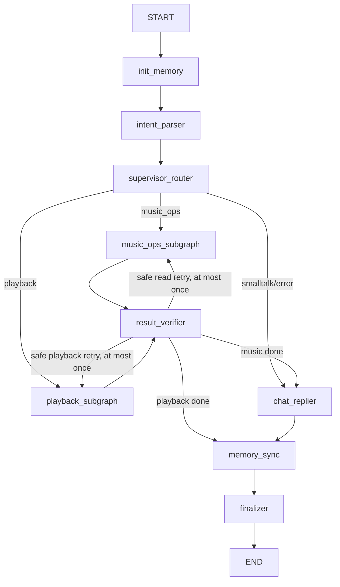

# 当前架构

> 最后核对时间：2026-07-16。本文只描述当前集成分支中已经实现并通过自动化验证的机制。

## 系统形态

MusicChatAgent 是本地单账号 QQ 音乐助手：

- 后端：FastAPI、LangChain、LangGraph。
- 前端：`music-agent-chat-ui/` 中的 Next.js 15 应用。
- 活跃聊天入口：`/chat/local`。
- `/chat/online` 只重定向到 `/chat/local`；LangGraph SDK online chat、Stream/Thread providers 和代理 API 已移除。
- 点击播放、歌单翻页等确定性 UI 动作继续直接调用 FastAPI，不经过 LLM。

## 启动与持久化生命周期

`main.py` 在导入 LangGraph 前加载 `.env`，并强制要求 `LANGGRAPH_STRICT_MSGPACK=true`。

FastAPI lifespan：

1. 打开 `AsyncSqliteSaver` checkpoint 连接。
2. 打开独立的 `aiosqlite` 偏好仓库连接。
3. 对 SQLite 设置 WAL、`busy_timeout=5000` 和 foreign keys。
4. 注入 checkpointer 与 `SQLitePreferenceRepository` 后编译 Graph。
5. 服务关闭时清除 `app.state` 引用，再按所有权顺序关闭连接。

数据库路径由 `MUSIC_AGENT_STATE_DB` 配置；相对路径始终相对仓库根目录解析，默认是 `data/music_agent.sqlite3`。后端没有静默回退到内存 checkpointer。

## 身份与会话隔离

本地聊天身份只从当前 QQ Music Credential 的 `musicid`/`str_musicid` 派生。客户端请求只允许提供 `message` 和可选 `thread_id`，不能提交 `user_id`。

Graph checkpoint key 使用长度前缀拼接后的 SHA-256：

```text
music:sha256(user_id, thread_id)
```

API 响应继续返回原始 `thread_id`，但数据库 key 不暴露 QQ 用户标识。当前实现适合本地单账号演示，不是 Session/JWT、多账号 Credential 管理或生产级认证系统。

## LangGraph 流程



所有自然语言分支最终都会经过 `memory_sync` 和 `finalizer`。

`messages` 使用 `add_messages` reducer。Agent 节点只返回本轮 delta，并保留工具调用产生的 `ToolMessage`；Verifier 只返回新增或被替换的消息，不返回完整历史。

## ToolResult、验证与 Artifact

核心工具返回统一 `ToolResult` JSON：

- `ok/code/message/data/retryable` 表达确定性结果。
- 副作用结果未知时使用 `WRITE_UNCERTAIN`，不自动重试。
- 只有查询类、明确标记 retryable、且当前 attempt 没有写工具时，Verifier 才允许最多一次重试。
- 播放和歌单 payload 使用严格 Pydantic schema；未知类型、非法 URL、缺少分页字段或重复 track 被拒绝。

`ArtifactCollector` 可以从 delta AI/Tool messages、ToolResult 的 `data` 和迁移期旧 JSON 文本中收集 Artifact。`app.schemas` 是规范实现，`app.models.chat_artifacts` 只是兼容导出层。

只有带服务端 `user_visible=true` 元数据的 `ChatReplier` 或终态 `PlayAgent` 消息能成为用户回复或历史消息。客户端或内部 Agent 伪造的同名字段不会绕过节点清洗。

## 记忆

当前记忆分层：

- 工作记忆与完整消息：SQLite LangGraph checkpoint，按用户和线程隔离。
- 会话摘要：保存在 checkpoint state；只对尚未摘要的消息增量更新，失败时保留旧摘要和完整消息。
- 长期偏好：SQLite 结构化 bucket，区分歌手、流派、语言、场景等 liked/disliked 项；使用严格 schema、版本号、事务和并发锁合并。
- `soul.md`：只读产品策略输入，不在普通聊天中自动改写。

旧的共享 `user_profile.md` 和 `history.jsonl` 不再是在线写入或权威历史来源。偏好提取只有在当前用户文本出现明确偏好线索时才调用辅助模型；提取或存储失败只降级为不更新，不改变音乐操作结果。

## API 合同

`POST /api/v1/chat/local`：

- 使用认证身份和哈希 checkpoint key 执行 Graph。
- 成功响应保留 `reply/trace`，并返回 `run` 和经过校验的 `artifacts`。
- 模型或 Graph 异常返回稳定 JSON 与 `agent_upstream_error`，不把 traceback、secret 或私密历史返回前端。
- SQLite 异常映射为 `503 storage_unavailable`。

`GET /api/v1/chat/local/history`：

- 使用 `graph.aget_state()` 读取权威 checkpoint。
- 只返回完整 HumanMessage 和受信的可见 AIMessage。
- 不返回内部 executor、工具消息、摘要或截断 preview。
- 没有可靠消息时间时，从 snapshot 时间生成稳定、严格递增的展示时间。

## 前端

`features/chat-local/` 是唯一活跃聊天 feature：

- service 对所有非 2xx 响应抛出用户可读错误，并兼容 `message`、字符串 `detail` 和 `detail.message`。
- hook 优先加载 localStorage 缓存；无缓存时从 checkpoint history 恢复。
- 新响应优先使用 `data.artifacts`，只有旧消息没有结构化 Artifact 时才解析文本 JSON。
- 播放器与歌单浏览仍使用确定性 REST API。

## 已验证范围

2026-07-16 集成验收：

- 后端完整测试：237 passed。
- 前端 service 测试：3 passed。
- TypeScript `tsc --noEmit`：通过。
- Prettier chat-local 检查：通过。
- Next lint：0 error，存在预先已有 warnings。
- Next production build：通过，生成 11 个静态页面。

尚未完成真实 QQ Music + DeepSeek/OpenAI 兼容服务的浏览器 E2E；自动化测试使用 fake graph/service，不把外部服务可用性写成已验证事实。
