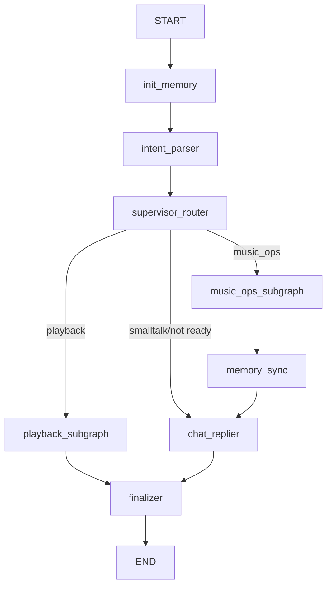

# 当前架构

> 最后核对时间：2026-06-11。核对方式为阅读仓库文件和本轮源码 diff。本次更新没有启动运行时服务，没有执行 `pytest`、前端构建或浏览器 E2E；运行结果等待人工验证。

## 系统形态

MusicChatAgent 是一个 QQ 音乐助手项目，后端使用 Python/FastAPI，前端位于 `music-agent-chat-ui/`，使用 Next.js。

- 后端入口：`main.py` 创建 FastAPI 应用，允许 `http://localhost:3000` 跨域，并把 `app.api.v1.endpoints.router` 挂载到 `/api/v1`。
- 当前包内活跃 Graph：`app.agents.music_team_v3_1:graph`。
- 当前前端聊天页面：`music-agent-chat-ui/src/app/chat/local/page.tsx`。
- `/chat/online` 当前重定向到 `/chat/local`；从已检查代码看，它不是正在工作的 LangGraph SDK 流式 UI。

## 后端 API

`app/api/v1/endpoints.py` 当前把聊天、认证、用户、歌曲、歌单、工具辅助接口和前端播放器直连接口放在同一个模块中。

重要聊天接口：

- `POST /api/v1/chat/local`
  - 接收 `{ message, thread_id? }`。
  - 使用 `HumanMessage` 和可配置 `thread_id` 调用 `graph.astream(..., stream_mode="updates")`。
  - 通过检查已知节点输出来构造调试用 `trace`。
  - 在消费 graph `updates` 时扫描每个已知节点输出的 `messages`，通过 `ArtifactCollector` 收集结构化 `artifacts`；最终 delta 会再扫描一次用于旧 JSON 文本兼容。
  - 成功响应：`{ status: "success", data: { thread_id, reply, trace, run: { status: "succeeded" }, artifacts: [...] } }`。
  - 错误响应（空消息/Graph 异常）：`{ status: "error", message, data: { thread_id?, run: { status: "failed", error }, artifacts: [] } }`。
  - 空消息返回 400，Graph 异常返回 502。错误不泄露 traceback 或 secret。
- `GET /api/v1/chat/local/history`
  - 读取 `app/agents/memory/history.jsonl`。
  - 从每条事件的 `message_tail` 预览中重建展示消息。
  - 这是基于预览的恢复路径，不是完整、权威的聊天消息存储。

前端播放器直连接口：

- `GET /api/v1/playlist/{dirid}/tracks` 返回 `playlist_browser` payload，用于确定性的 UI 歌单分页。
- `GET /api/v1/song/play-url` 按 `song_mid` 返回 `play_music` payload，用于确定性播放。

## 当前 LangGraph 流程

编译后的 Graph 定义在 `app/agents/music_team_v3_1/graph.py`，当前 checkpointer 使用 `InMemorySaver`。



当前不对称点：

- `music_ops_subgraph` 会经过 `memory_sync`，再到 `chat_replier`。
- `playback_subgraph` 会直接进入 `finalizer`。
- 闲聊和解析失败路径会进入 `chat_replier`，再到 `finalizer`，绕过 `memory_sync`。

## Agent

`app/agents/music_team_v3_1/agents.py` 在模块导入时构造三个 LangChain agent：

- `MusicExecutor`：调用工具的 QQ 音乐账户操作 agent，负责搜索、创建歌单、加歌、删歌、查询歌单详情等。
- `PlayAgent`：调用工具的播放 agent，负责播放和歌单浏览。
- `ChatReplier`：不调用工具的回复 agent，用于改写或整理最终回复。

主音乐模型由 `MUSIC_AGENT_MODEL`、`MUSIC_AGENT_BASE_URL` 和 `MUSIC_AGENT_API_KEY` 配置。
次级模型由 `OPENAI_MODEL`、`OPENAI_API_BASE` 和 `OPENAI_API_KEY` 配置。

## 状态模型

`MusicGraphStateV31` 当前包含：

- `thread_id`
- 使用 LangGraph `add_messages` reducer 的 `messages`
- `task`：包含 intent、status、extracted/missing slots、retries 和 error 字段
- `memory`：包含 summary/profile/soul 路径和已加载文本
- `control`：包含 route、重入限制、summary/profile/soul 标志和 ready 状态
- `extensions`：保留给未来扩展的任意数据

当前重要行为：

- `intent_parser_node` 会把最新用户文本写入 `task.goal`。
- `build_runtime_messages()` 仍会把完整提取出的 messages 传给 executor/replier。
- 对非 parser 角色，`build_runtime_messages()` 会在存在时前置 summary、`user_profile` 前 2200 个字符，以及 `soul` 前 2200 个字符。
- `music_ops_subgraph_node`、`playback_subgraph_node`、`chat_replier_node` 当前返回 agent 本轮产生的 delta messages，而不是旧历史消息列表。
  delta 中可以包含 `ToolMessage` 和最终 `AIMessage`，用于保证 `play_music_tool -> ToolMessage -> API artifacts` 路径不丢数据。
  `add_messages` reducer 负责把这些 delta 合并回 state。
`memory_sync_node` 仍存在 `state["messages"]` 原地修改风险，已记录在 DEVNOTES 中。

## 记忆

记忆文件位于 `app/agents/memory/`：

- `user_profile.md`：共享 Markdown 用户画像。
- `soul.md`：共享 Markdown 策略/人格文档。
- `history.jsonl`：追加写入的事件日志，用于预览和类似 trace 的历史展示。

当前记忆生命周期：

1. `init_memory_node` 确保记忆文件存在，并把 profile/soul 读入 state。
2. `memory_sync_node` 通过累加消息内容长度估算 token 压力，而不是使用模型 tokenizer。
3. 如果估算值达到 `MUSIC_AGENT_SUMMARY_TRIGGER_TOKENS`，默认 `5000`，它会请求次级 LLM 生成摘要，并只保留最新的 `MUSIC_AGENT_SUMMARY_KEEP_MESSAGES` 条消息。
4. 对 done 或 waiting 任务，它会请求次级 LLM 重写/更新 `user_profile.md`。
5. 只有 `MUSIC_AGENT_ENABLE_SOUL_AUTOTUNE=true` 时才会发生运行时 soul 更新；默认值是 false。
6. 它会追加一条 history event，包含工具调用、消息数量和最后三条消息预览。

当前限制：

- profile/soul 文件在线程之间共享，已检查代码中没有看到用户命名空间。
- profile 通过固定字符前缀注入，不是按相关性检索。
- summary 当前不是独立持久化存储。
- 在已检查 Graph 中，playback 和 smalltalk 分支不会经过 `memory_sync`。

## 前端

当前活跃的本地聊天功能位于 `music-agent-chat-ui/src/features/chat-local/`。

- `useLocalChatSession.ts` 检查登录状态，加载 localStorage 或后端预览历史，发送消息，并把消息写回 localStorage。
- `localChatApi.ts` 调用 `/auth/status`、`/chat/local/history` 和 `/chat/local`。
- `AssistantMessageRenderer.tsx` 优先从结构化 `data.artifacts` 渲染，旧文本 parser 作为 fallback。
- `artifacts.ts` 定义共享 `ChatArtifact` 类型和类型守卫。
- `utils.ts` 中的 `selectRenderableArtifacts()` 负责选择渲染来源：结构化 artifacts 优先，旧文本 JSON 仅在无 artifacts 时兼容，并会把 legacy `play_music` payload 补齐成统一结构。
- `music_player_artifact.tsx` 和 `playlist_browser_artifact.tsx` 渲染对应的 artifact 组件。

当前前端契约：

- 后端返回结构化 `data.artifacts` 作为一等字段；`reply` 文本保留兼容。
- `ChatMsg` 包含可选 `artifacts` 字段。
- 前端优先消费 `artifacts`，旧文本解析只保留给无 artifact 的历史消息。
- workflow trace 是调试详情面板，不是稳定的公开运行状态契约。

## 验证入口

项目说明中已有的命令：

```powershell
pytest
```

```powershell
cd music-agent-chat-ui
pnpm lint
pnpm format:check
pnpm build
```

2026-06-11 本轮源码更新后，只执行了 `git diff --check`，没有执行运行时验证。后续验收应至少覆盖：

- `POST /api/v1/chat/local` 普通聊天、播放请求、后端异常和浏览器 Origin 下的 502 JSON 响应。
- `play_music_tool` 返回 JSON 经过 `ToolMessage` 后仍能出现在 `data.artifacts`。
- 前端本地聊天优先渲染结构化 artifacts，旧文本 JSON 仍能兼容。
