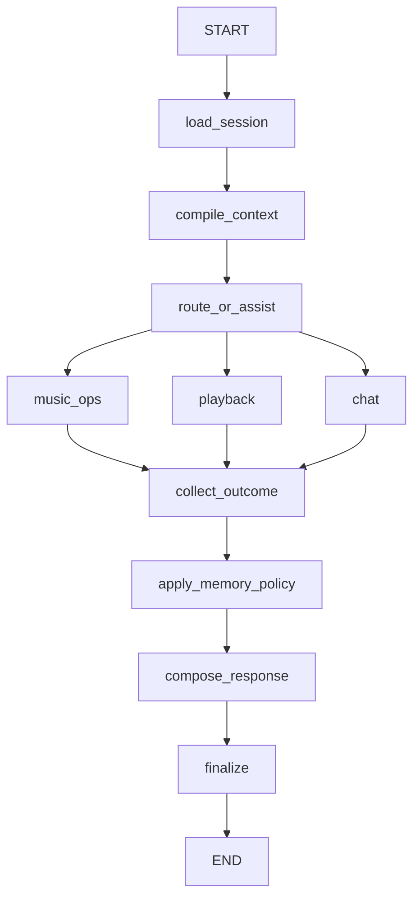

# 上下文优先级、记忆治理与工作流体验优化设计

> Status: Draft
>
> Date: 2026-06-11
>
> Related: [确定性动作与结构化 Artifact 优化规格](../../SDD/spec/deterministic-action-and-artifact-spec.md)

## Background

MusicChatAgent 已具备 FastAPI、LangGraph、多代理工具调用、本地聊天页面和播放器 Artifact，
但当前主链路把多种语义不同的信息直接拼进同一模型上下文：完整会话、摘要、`user_profile.md`、
`soul.md` 和当前请求之间没有可执行的优先级合同。代码虽然把最后一条用户消息写入
`task.goal`，执行代理仍收到完整历史，因此旧要求、过时画像或长上下文可能压过用户最新纠正。

当前实现还存在以下系统性问题：

- `build_runtime_messages()` 注入完整消息，并对 profile/soul 做固定字符截断；截断不等于相关性检索。
- 摘要触发依据字符数而非模型 token，摘要只存在于当前 Graph state，且不同分支并不都经过记忆同步。
- profile 在多数成功操作后由 LLM 整篇重写，缺少事实证据、字段级校验、用户隔离和大小预算。
- soul 虽默认关闭自动调优，但仍被设计成运行时可写的全局文件；稳定行为策略与用户记忆边界不清。
- `music_ops`、`playback`、`smalltalk` 三条分支的记忆、回复和 finalization 路径不一致。
- Graph 使用 `add_messages` reducer，但节点返回“旧消息 + 新消息”，存在重复累积风险。
- 聊天 API 返回文本 `reply` 和调试 `trace`；前端仍需从文本或 trace 猜测 Artifact。
- `/chat/online` 当前重定向到本地聊天，前端没有真正统一的流式运行状态、取消和失败恢复模型。
- `history.jsonl` 是裁剪后的审计事件，却同时被当作聊天历史恢复来源，语义不一致。

这些问题的共同后果不是单纯“上下文太长”，而是系统缺少一份明确的上下文、状态、记忆和响应合同。

## Goals

1. 保证用户当前轮的明确要求和纠正，在不违反系统安全约束的前提下高于旧对话、摘要和画像。
2. 建立有 token 预算、可观测、可测试的 `ContextEnvelope`，不再把所有可用文本无差别塞给 Agent。
3. 将工作记忆、任务状态、会话摘要、长期画像、稳定策略和审计历史分开治理。
4. profile 只保存有证据的长期事实，按用户隔离、按需检索、字段级更新，并支持纠错和失效。
5. soul 成为版本化、人工评审的产品策略，不在普通对话请求中自动改写。
6. 让所有自然语言分支经过一致的执行结果收集、记忆策略、回复编排和 finalization。
7. 让后端返回结构化消息、Artifact 和公开运行事件，前端不依赖解析任意 AI 文本。
8. 为“最新指令遵循、上下文成本、工具成功率、记忆准确率和前端恢复”建立回归评测。
9. 保持现有 QQ 音乐服务、确定性播放 API 和迁移期旧消息可用。

## Non-goals

- 不重写 QQ 音乐认证、服务层或所有工具实现。
- 不把播放器暂停、拖动、歌单翻页等已知 UI 动作改成 LLM 请求。
- 不建设跨领域通用工作流引擎，也不恢复全局通用 slots 状态机。
- 不向前端暴露模型思维链、完整 system prompt、原始 profile 或 secret。
- 不在本规格中强制选定 Redis；持久化通过接口隔离，本地和部署环境可采用不同实现。
- 不承诺一次性合并全部 Agent。是否合并以评测结果和工具风险为依据。
- 不把历史 Markdown 文档自动迁移为运行时数据源。

## Current Constraints

- 活跃 Graph 为 `app.agents.music_team_v3_1:graph`，默认 checkpointer 是 `InMemorySaver`。
- API 使用 `/api/v1/chat/local` 的非流式 JSON 响应，但内部通过 `graph.astream(..., stream_mode="updates")` 收集节点事件。
- 前端当前只提供本地 REST 聊天；`/chat/online` 重定向到 `/chat/local`。
- 现有 profile、soul 和 history 位于共享目录 `app/agents/memory/`，没有用户命名空间。
- 工具型 Agent 和 LLM 在模块导入时创建，聚焦测试难以注入替身。
- 现有 [Artifact SDD](../../SDD/spec/deterministic-action-and-artifact-spec.md) 已定义结构化 Artifact 方向，本规格不重复定义全部播放器字段。
- 仓库自动化测试覆盖很少，前端未配置组件测试脚本；实施必须先建立行为基线。

## Design Principles

### 1. 最新请求不是“更多上下文中的一段文本”

当前请求必须是独立状态字段和 Agent 输入的最后一条 `HumanMessage`。旧信息只能帮助解析当前请求，
不能隐式改写当前请求。若发生冲突，采用以下优先级：

1. 平台安全、权限、工具真实结果和不可变产品约束。
2. 当前轮用户明确请求、否定和纠正。
3. 当前未完成任务中仍被用户确认的约束。
4. 最近对话和最近结构化工具结果。
5. 与当前请求相关的长期 profile 事实。
6. 会话摘要和更早历史。
7. 默认风格偏好。

例如，profile 记录“喜欢林俊杰”，但用户当前说“今天不要林俊杰”，本轮必须排除林俊杰；只有
“以后不要再推荐林俊杰”这类明确长期表达，才产生 profile 变更候选。

### 2. 先裁决语义，再压缩文本

上下文优化不能只做字符截断。系统先区分当前请求、任务、近期消息、摘要、画像事实和策略，
再按每类预算装配。任何一类超限都采用该类自己的降级策略，不允许让 profile 挤掉当前请求。

### 3. 状态字段承载合同，Prompt 只负责解释合同

路由、执行结果、Artifact、记忆变更和错误码必须有结构化字段。Prompt 可以指导模型使用这些字段，
但不能让关键流程依赖中文关键词或“模型大概会原样输出 JSON”。

### 4. 记忆写入比记忆读取更保守

读取错误会影响一轮回复，写入错误会污染未来所有回复。长期记忆写入必须有证据、置信度、作用域、
验证和回滚信息；无法确认时宁可不写。

## User-visible Behavior

### 最新要求覆盖旧偏好

- 用户先说“播放陈奕迅”，随后说“改成王菲”，系统执行王菲，不继续携带上一轮执行目标。
- 用户说“只加两首，不要创建新歌单”，即使 profile 记录了常用自动建单行为，本轮也禁止自动创建。
- 用户说“第二首”时，系统只从最近一次可引用的结构化结果中解析；找不到可靠引用时询问，不猜测。

### 长对话继续可控

- 达到预算时，系统压缩较早对话，但始终保留当前请求、待确认约束和最近工具结果。
- 用户可看到正常回复，不会看到摘要、profile、soul 或内部 prompt。
- 摘要或画像更新失败不应把已经成功的音乐操作改成失败。

### 记忆可纠正

- 明确的长期偏好可以在后续会话中生效。
- 用户纠正偏好时，旧事实被失效或降权，不把相互冲突的两条事实同时注入。
- 临时请求、工具错误和一次性歌单操作不会自动变成长期性格或偏好。

### 前端工作流反馈

- 发送后显示公开阶段，如“理解请求、执行音乐操作、整理结果”，不展示思维链。
- 用户可以取消仍在运行且尚未提交副作用的请求。
- 失败时显示可重试/不可重试状态和稳定错误码；页面刷新后可恢复已提交的消息和 Artifact。

## Target Architecture

### Graph lifecycle



迁移第一阶段可以保留三个领域 Agent，但所有分支必须汇合。后续若评测证明单一工具 Agent 在工具选择、
延迟和安全上更好，可将 `route_or_assist` 与执行节点合并；Graph 的后半段合同保持不变。

### Node responsibilities

| Node | Responsibility | Must not do |
| --- | --- | --- |
| `load_session` | 加载线程状态、用户作用域和记忆版本 | 拼接最终 Prompt |
| `compile_context` | 构造有预算的 `ContextEnvelope` | 调用有副作用工具 |
| `route_or_assist` | 选择领域或直接回答 | 维护通用 slots |
| domain executor | 调用白名单工具并返回 `ExecutionOutcome` | 写 profile/soul |
| `collect_outcome` | 校验结果、错误和 Artifact | 从任意文本执行代码或信任未知 URL |
| `apply_memory_policy` | 生成并提交允许的记忆事件 | 改写稳定产品策略 |
| `compose_response` | 根据 outcome 生成用户文本 | 重建或修改已校验 Artifact |
| `finalize` | 写运行状态、指标和 checkpoint | 吞掉失败或遗留 running 状态 |

### Proposed state model

```python
class CurrentRequest(TypedDict):
    turn_id: str
    text: str
    received_at: str
    user_constraints: list[str]
    references: list[dict]

class ContextEnvelope(TypedDict):
    current_request: CurrentRequest
    active_task: dict
    recent_messages: list[BaseMessage]
    conversation_summary: str
    relevant_profile_facts: list[dict]
    recent_entities: list[dict]
    policy_version: str
    token_usage: dict[str, int]

class ExecutionOutcome(TypedDict):
    status: Literal["succeeded", "needs_user", "failed", "cancelled"]
    reply_facts: list[str]
    artifacts: list[dict]
    error_code: str | None
    error_message: str | None
    side_effects: list[dict]

class MusicGraphState(TypedDict, total=False):
    thread_id: str
    user_id: str
    messages: Annotated[list[BaseMessage], add_messages]
    request: CurrentRequest
    task: dict
    context: ContextEnvelope
    outcome: ExecutionOutcome
    memory_events: list[dict]
    public_events: list[dict]
```

`messages` 节点更新只返回新增 delta，例如 `{"messages": [ai_msg]}`。禁止在 reducer 字段中返回
`[*old_messages, new_message]`。

## Context Assembly

### Input order

Agent 输入按以下顺序构造：

1. 固定 system policy 与工具约束。
2. 当前任务状态和待确认限制。
3. 相关 profile 事实、摘要和最近实体，均带来源标签。
4. 有界最近消息。
5. 当前用户消息作为最后一条 `HumanMessage`。

`current_request.text` 同时保存在状态中，执行节点必须校验最后一条用户消息与该字段一致。

### Default budgets

预算必须可配置，并使用目标模型 tokenizer 或 LangChain token 计数器。建议初始总预算为 6000 tokens，
不含工具 schema 和输出预留：

| Segment | Default maximum | Degradation |
| --- | ---: | --- |
| 当前请求与任务约束 | 1000 | 不丢弃；过长时拒绝或要求拆分 |
| 最近消息与工具结果 | 2500 | 保留最近完整轮次，较早部分进入摘要 |
| 会话摘要 | 1000 | 结构化压缩，保留未完成任务和失败原因 |
| 相关 profile 事实 | 800 | 按相关性、置信度和新鲜度取 Top-K |
| 稳定策略补充 | 700 | 使用版本化短策略，不注入维护日志 |

超预算时先减少低相关 profile 和旧摘要，绝不截断当前请求的关键约束。每次运行记录各 segment token 数，
但不记录 secret 或完整私有文本。

### Reference resolution

“这首”“第二首”“刚才的歌单”等指代只从以下结构化来源解析：

- 最近一次 Artifact；
- 最近工具结果中的实体列表；
- 当前 active task 的已确认实体。

不能可靠唯一解析时返回 `needs_user`，不把猜测写进长期记忆。

## Memory Governance

### Memory classes

| Class | Scope | Examples | Persistence |
| --- | --- | --- | --- |
| Working memory | thread | 最近消息、最近 Artifact | checkpointer |
| Task memory | thread/task | 当前目标、确认项、副作用 | checkpointer |
| Summary | thread | 较早对话压缩、未完成事项 | summary store/checkpoint |
| Profile | user/account | 长期偏好、稳定实体映射 | profile store |
| Product policy | deployment | identity、hard rules、style envelope | version-controlled config |
| Audit event | run | 工具、状态、耗时、错误码 | append-only event store |

`history.jsonl` 只承担审计或开发诊断，不再作为权威聊天消息库。

### Profile fact contract

profile 从整篇 Markdown 重写迁移为结构化事实；Markdown 可以保留为人工查看导出格式。

```json
{
  "fact_id": "uuid",
  "namespace": "preference.artist.positive",
  "value": "陈奕迅",
  "confidence": 0.95,
  "source": "explicit_user_statement",
  "evidence_turn_id": "turn-123",
  "created_at": "...",
  "updated_at": "...",
  "valid_until": null,
  "status": "active"
}
```

写入规则：

- 用户明确长期表达可直接形成高置信候选。
- 从行为推断的偏好只能形成低/中置信候选，并要求重复证据后才能注入高影响决策。
- 当前轮临时限制默认只进入 task/session，不进入 profile。
- 用户纠正时以事件形式失效旧 fact，保留审计，不直接覆盖来源。
- 工具返回的 `dirid` 等稳定实体可写入独立实体命名空间，但必须来自成功工具结果。
- 每次只提交字段级 patch；校验失败时保留旧版本并记录 `memory_update_failed`。

### Soul policy

- 将现有 soul 内容冻结为版本化产品策略，运行时只读。
- 删除普通请求路径中的自动 soul 写入；`MUSIC_AGENT_ENABLE_SOUL_AUTOTUNE` 进入废弃流程。
- 风格演进通过设计文档、回归评测和人工评审提交，不由单次对话触发。
- 用户的称呼和表达偏好属于 profile 或当前请求，不写入 soul。

### Summary policy

- 使用 token 而非字符触发。
- 更新时输入“旧摘要 + 被压缩消息”，输出结构化摘要版本，而不是每次重写全部历史。
- 必须保留未完成任务、待确认项、最近失败、最近 Artifact 引用和用户最新纠正。
- 至少保留最近 4 个完整轮次；具体数量由 token 预算决定。
- summary 更新失败时继续使用旧摘要和近期消息，不能清空历史。

### Scope and concurrency

所有持久化 key 至少包含 `user_id/account_id` 和 `thread_id`。单账号本地模式可由 QQ 账号派生稳定 user key，
但不得继续使用所有线程共享的无命名空间 profile 文件。文件存储阶段必须使用原子替换和进程内锁；
多进程或部署阶段切换到支持并发的存储实现。

## API and Frontend Contract

### Chat response

在兼容现有 `reply` 和 `trace` 的迁移期，新增稳定字段：

```json
{
  "status": "success",
  "data": {
    "thread_id": "...",
    "run_id": "...",
    "message": {
      "id": "...",
      "role": "assistant",
      "content": "已找到并准备播放。",
      "created_at": "..."
    },
    "artifacts": [],
    "run": {
      "status": "succeeded",
      "events": [
        {"stage": "context", "status": "completed", "label": "已理解请求"}
      ],
      "error": null
    },
    "reply": "已找到并准备播放。",
    "trace": []
  }
}
```

公开事件只包含阶段、状态、耗时、稳定错误码和用户可理解标签。内部节点输入、模型 prompt、profile 原文、
工具 secret 和思维链不得进入响应。

### Streaming and cancellation

- 保留非流式 `/chat/local` 作为兼容入口。
- 新增版本化流式入口时优先使用 SSE；事件 schema 与最终 `run.events` 相同。
- 每次请求带 `run_id` 和幂等键。取消只阻止未开始的步骤；已提交的歌单写操作必须返回真实结果。
- 查询类网络错误可有限重试；创建、添加、删除等副作用工具不得在结果未知时自动重试。

### Frontend modules

- `features/chat/transport`：统一请求、SSE、AbortController、错误映射。
- `features/chat/session`：服务器消息为权威来源；localStorage 只保存 thread id、草稿和有版本的缓存。
- `features/chat/artifacts`：按联合类型注册组件，不从普通文本解析新响应。
- `features/chat/run-status`：渲染公开工作流阶段、失败和重试操作。
- `/chat/online` 与 `/chat/local` 收敛到同一 feature；路由差异只体现在 transport 配置。

前端工作流视图不展示内部 chain-of-thought。它是运行状态面板，不是 LangSmith 的替代品。

## Security and Reliability

- 记忆、trace、日志和 API 错误不得包含 LLM key、QQ 凭证、完整 system prompt 或未裁剪工具响应。
- Artifact 只接受白名单类型并通过 Pydantic/Zod 双端校验；播放 URL 必须来自受信服务层。
- 所有运行结束状态必须是 `succeeded/needs_user/failed/cancelled` 之一，不能遗留 `running`。
- profile 写入使用版本号或 compare-and-swap，避免并发线程互相覆盖。
- 副作用工具记录 idempotency key、目标实体和可验证结果；超时表示“结果未知”，不是“失败可重试”。
- 记忆维护 LLM 与主回复 LLM 都必须有超时；记忆失败降级为不更新，并保留用户操作结果。
- 审计事件使用 preview/哈希/结构化字段，默认不保存完整私密对话。

## Compatibility and Migration

1. 先增加新状态字段和适配器，不立即删除旧 `task/control/memory` 字段。
2. 先修正 message delta 和统一 Graph 汇合路径，再替换上下文装配。
3. 聊天 API 先新增 `message/artifacts/run`；旧 `reply/trace` 保留一个迁移周期。
4. 前端优先读取新字段，旧文本 JSON parser 只用于历史消息和旧响应。
5. 现有 `user_profile.md` 通过一次性解析器迁移为 facts；无法确认的字段标记为低置信，不自动执行高影响行为。
6. 现有 `soul.md` 作为初始 policy v1 导入版本控制，停止运行时写入。
7. `InMemorySaver` 保留为开发 fallback；持久化 checkpointer 在接口和恢复测试稳定后启用。
8. 旧 `history.jsonl` 保留只读，不承诺恢复被 preview 截断的完整消息。

## Alternatives

### 仅提高 profile 截断长度

拒绝。更长截断仍然没有相关性、作用域和冲突规则，只会增加 token 成本。

### 每轮都总结完整历史

拒绝。会增加延迟和模型调用，并可能反复丢失细节。应采用增量摘要和确定的近期消息窗口。

### 完全删除 profile 和 summary

拒绝。短会话会更简单，但跨会话偏好、稳定实体映射和长任务恢复会退化。

### 让单一超级 Agent 自己判断所有状态

暂不作为前置条件。单 Agent 可降低路由调用，但不会自动解决上下文优先级、结构化结果和记忆污染。

### 继续自动调优 soul

拒绝。稳定产品行为不应被一次会话或低置信模型改写；演进必须可评审、可回归、可回滚。

## Acceptance Criteria

### Context and instruction priority

- 至少 20 条“旧要求与最新纠正冲突”评测全部遵循最新明确要求。
- 当前请求、待确认约束和最近工具引用不会因摘要或 profile 超限而被丢弃。
- 每次 Agent 调用记录各 context segment token 数，总量不超过配置预算。
- profile 只注入相关 facts，不再使用固定字符截断整篇文件。

### Graph and state

- smalltalk、music_ops、playback、needs_user 和失败路径全部经过 outcome、memory policy、response 和 finalizer。
- reducer 字段只返回 delta；多轮测试中消息数量不出现重复倍增。
- 每次 run 都有唯一终态和稳定错误码，取消/超时不会伪装成功。
- 自然语言请求不依赖全局通用 slots 才能执行。

### Memory

- soul 在运行时不可写，普通聊天无法改变 policy version。
- profile 更新包含用户作用域、证据 turn、置信度和版本；错误更新可失效或回滚。
- 临时限制不会进入长期 profile；明确长期偏好在新线程中可被相关检索命中。
- summary 失败时会话仍可继续，且最新完整轮次仍然存在。

### API and frontend

- 新聊天响应提供结构化 `message`、`artifacts` 和 `run`，旧 `reply` 在迁移期保持兼容。
- 新响应的 Artifact 不经过文本提取即可渲染；未知类型安全降级为普通附件或忽略。
- 用户可取消运行，网络错误有明确反馈，页面刷新可恢复服务器已提交消息。
- 工作流面板只展示公开阶段，不泄露内部 prompt、profile 或思维链。

### Verification

- 后端聚焦状态、上下文、记忆和 API 合约测试通过。
- 前端类型检查、lint/build 和聊天关键组件测试通过。
- 至少完成长对话、最新纠正、播放、歌单副作用、取消和恢复六类 E2E 场景。
- 记录优化前后平均输入 token、P50/P95 延迟、工具成功率和指令遵循率；目标是输入 token 均值下降至少 30%，但不得以降低最新指令遵循率为代价。

## Open Questions

1. 本地单账号模式的 `user_id` 使用 QQ 号、凭证主体还是应用生成 ID；不得把敏感凭证本身作为 key。
2. 首个持久化实现采用 SQLite checkpointer 还是 Redis，取决于部署形态和并发需求。
3. 三个 Agent 最终是否合并，需要用工具选择准确率、延迟和副作用安全评测决定。
4. profile 事实是否需要用户可视化编辑页面；第一阶段至少提供开发期查看和失效工具。
5. 流式 API 使用现有 FastAPI SSE 还是 LangGraph SDK，需要在统一事件 schema 后做小型验证。
